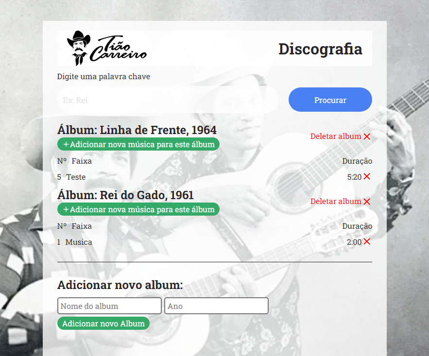

# Tião Carreiro e Pardinho

## Projeto desenvolvido para teste de seleção de conhecimento para Programador React Trainee na empresa Supliu.

## 📋 Requisitos

✔️ [API](https://tiao.supliu.com.br/);

✔️ Ver lista de álbuns e faixas

✔️ Pesquisar álbuns por nome;

✔️ Adicionar um novo álbum;

✔️ Adicionar uma nova faixa em um álbum;

✔️ Excluir uma faixa;

✔️ Excluir um álbum;

## 🛠 Tecnologias

 HTML

 CSS

 JavaScript

 ReactJS

 &nbsp;Axios

 Styled-components

## 🛠 Projeto finalizado

